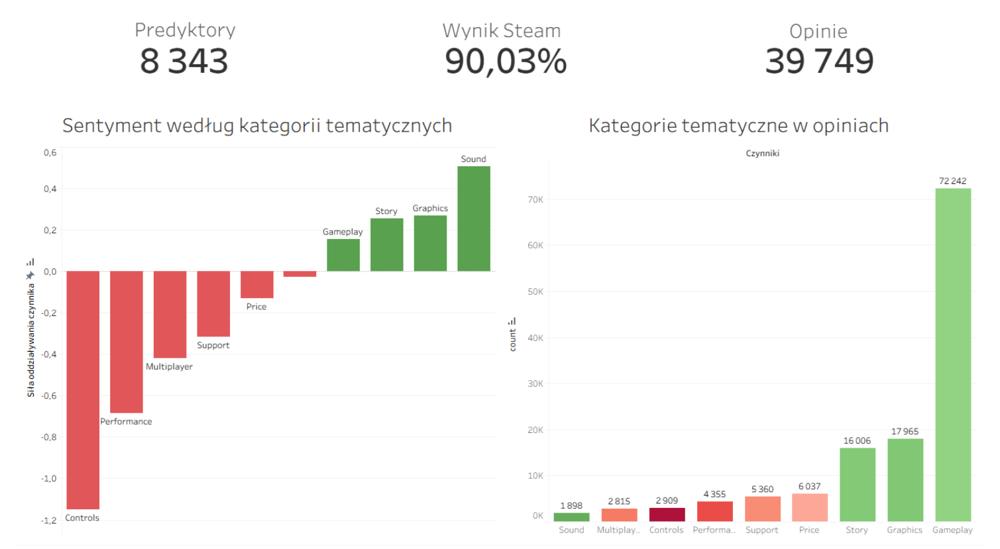
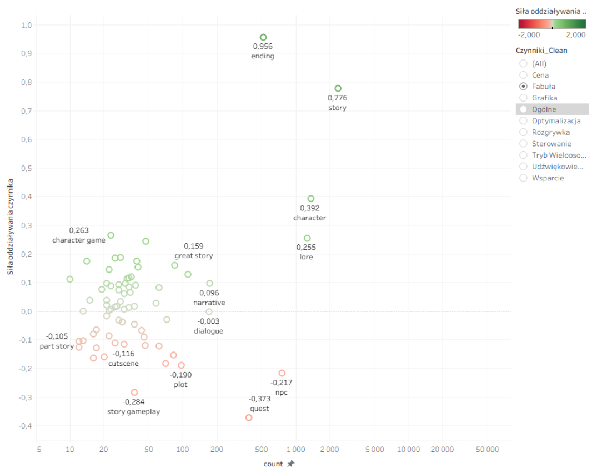

# Decoding the Masochism:   NLP Sentiment Analysis of FromSoftware Games

> Why do players leave glowing positive reviews that say, "This game ruined my life and punished me for 100 hours"?

Standard sentiment analysis tools see words like "brutal," "punishing," and "hard" and classify them as negative. But in the "soulslike" genre, this is the highest form of praise. Standard horizontal analytics fail here. This project bridges that cognitive gap.

Project was made for my BSc Thesis and is written entirely in Polish. Whole paper in Polish can be read [here](thesis.pdf)

# 📖 General Idea

This repository houses an end-to-end Machine Learning and Business Intelligence pipeline designed to decode the highly idiosyncratic jargon of the FromSoftware player base.

By employing custom Natural Language Processing (NLP) techniques and Logistic Regression, this tool translates chaotic, unstructured Steam reviews into actionable Key Success Factors (KSFs), visualized through interactive Tableau dashboards.

# 🚀 The Pipeline (CRISP-DM)

Pipeline of the whole project is founded on [CRISP-DM](https://www.datascience-pm.com/crisp-dm-2/) methodology which I highly recommend for every Business Data Analytist to know.

- **Data Acquisition**: A custom Selenium script that bypasses age-gates and handles infinite-scroll to scrape thousands of Steam reviews.

- **NLP Preprocessing**: Utilizes NLTK to clean ASCII spam, lemmatize words, and strictly preserve negations (which are critical for sentiment context).

- **Predictive Modeling**: A Scikit-Learn TF-IDF vectorizer paired with a Logistic Regression classifier. The model uses strategic downsampling to overcome a massive 90:10 class imbalance

- **Factor Extraction**: Maps learned feature weights to predefined game design categories (e.g., Gameplay, Graphics, Support).

- **Business Intelligence**: Exports clean data into Tableau Desktop to create hierarchical, drill-down dashboards for executive decision-making.

# 📊 Outcome

The outcome is set of 2 interactive Tableau dashboards that help managerial board to make decisions about what to improve and what works for their game. Previously shown dashboard is a set of most important metrics. Another dashboard is an operational one showing most important words in every category.

⚙️ How to Use

This repository is logically separated into three main parts to reflect the progression of the analytical pipeline:

- **scraper/:** Contains the automated Selenium scripts used for extracting raw review data from Steam.

- **analizator/:** Houses the core Python engine responsible for NLP preprocessing, TF-IDF vectorization, and training the Logistic Regression model.

- **dashboards.twbx:** The final Tableau workbook featuring the interactive managerial dashboards.

To run the project, please navigate to each specific directory. Detailed step-by-step execution instructions and specific requirements are located inside their respective folders.

# 🛠️ Tech Stack

- Data Engineering: Python 3.9+, Pandas, Numpy

- Web Scraping: Selenium, webdriver-manager

- NLP & ML: Scikit-Learn, NLTK

- Data Visualization: Tableau Desktop 2023.1+, Matplotlib, Seaborn
